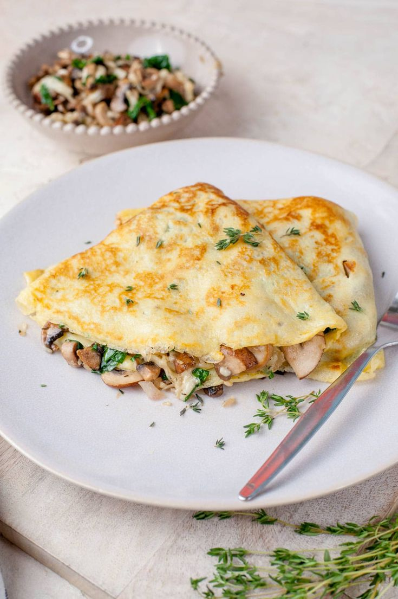

# Menu

## Pizze klasyczne na bazie sosu pomidorowego

|Lp.|Pizza:                                                                |rozmiar: |24 cm |30 cm |45 cm |
|---|----------------------------------------------------------------------|---------|------|------|------|
|1. |MARGHERITA (sos, ser mozzarella, oregano)                             |         |20 zł |25 zł |30 zł |
|2. |FUNGHI (sos, ser mozzarella, pieczarki)                               |         |22 zł |27 zł |32 zł |
|3. |SALAMI (sos, ser mozzarella, salami)                                  |         |22 zł |27 zł |32 zł |
|4. |PROSCIUTTO (sos, ser mozzarella, szynka)                              |         |22 zł |27 zł |32 zł |
|5. |HAWAJSKA (sos, ser mozzarella, szynka, ananas)                        |         |23 zł |28 zł |33 zł |
|6. |KEBAB (sos, ser mozzarella, kurczak, kukurydza, cebula)               |         |25 zł |30 zł |35 zł |
|7. |SEROWA (sos, 4 sery- mozzarella, pleśniowy, cambert, feta)            |         |25 zł |30 zł |35 zł |
|8. |SPINACI (sos, ser mozzarella, ser pleśniowy, kurczak,szpinak)         |         |26 zł |31 zł |36 zł |
|9. |TOSCANA (sos, ser mozzarella, karczochy, szynka, kukurydza)           |         |25 zł |30 zł |35 zł |
|10.|TROPICANA (sos, ser mozzarella, kurczak, ananas, kukurydza)           |         |25 zł |30 zł |35 zł |

## Pizze wegetariańskie

|Lp.|Pizza WEGE:                                                                                          |rozmiar:|24 cm |30 cm |45 cm |
|---|-----------------------------------------------------------------------------------------------------|--------|------|------|------|
|1. |VEGETARIANA (sos pomidorowy, ser z napoju sojowego, brokuły, kukurydza, pieczarki)                   |        |23 zł |28 zł |33 zł |
|2. |VEGE CHEESE (sos pomidorowy, ser z napoju sojowego, pieczarki, pomidory,oregano)                     |        |23 zł |28 zł |33 zł |
|3. |VEGE MIĘSNA (sos pomidorowy, ser z napoju sojowego, vege boczek z soczewicy, oregano)                |        |22 zł |27 zł |32 zł |
|4. |KURKOWA (sos pomidorowy, ser z napoju sojowego, vege boczek z soczewicy, kurki, cebula, papryka)     |        |25 zł |30 zł |35 zł |

## Pizze na bazie sosu śmietanowego

|Lp.|Pizza:                                                                               |rozmiar:|24 cm |30 cm |45 cm |
|---|-------------------------------------------------------------------------------------|--------|------|------|------|     
|1. |BIANCA (sos śmietanowy, ser mozzarella, szynka, cebula,boczek)                       |        |26 zł |31 zł |36 zł |
|2. |CARBONARA (sos śmietanowy, ser mozzarella, boczek, pieczarki, cebula)                |        |27 zł |32 zł |37 zł |
|3. |PARMA (sos śmietanowy, ser mozzarella, szynka parmeńska, szparagi, pieczarki, jajko) |        |29 zł |34 zł |39 zł |
|4. |VERDE (sos śmietanowy, ser mozzarella, ser cambert, boczek, świeży szpinak)          |        |28 zł |33 zł |38 zł |

## Naleśniki zapiekane

|Lp.|Naleśniki zapiekane:                                                                                        |porcja:|300 g |500 g |
|---|------------------------------------------------------------------------------------------------------------|-------|------|------|
|1. |SZPINAKOWY (szpinak, kurczak, podgrzybki, ser mozzarella, sos śmietanowy)                                   |       |29 zł |34 zł |
|2. |CURRY (kurczak, cukinia, brokuły, pomidory szuszone, czerwona cebula, sos curry)                            |       |28 zł |33 zł |
|3. |MEKSYKAŃSKI (mięso mielone, czerwona fasola, papryka jalapeno, cebula, kukurydza, ser mozzarella, tabasco)  |       |30 zł |35 zł |
|4. |SEROWY (kurczak, brokuły, pieczarki, czerwona cebula, ser mozzarella, sos serowy)                           |       |29 zł |34 zł |

## Sałatki

|Lp.|Sałatki                                                                                        |porcja:|250 g |500 g |
|---|-----------------------------------------------------------------------------------------------|-------|------|------|
|1. |GRECKA (sałata lodowa, pomidory, ogórek, oliwki, czerwona cebula)                              |       |26 zł |32 zł |
|2. |SEZAM (mix sałat, kukurydza, pomidory, ogórek, czerwona cebula, sos sezamowy)                  |       |28 zł |34 zł |
|3. |MEKSYKAŃSKA (czerwona fasola, papryka jalapeno, cebula, kukurydza,tabasco, nachosy)            |       |29 zł |35 zł |
|4. |OWOCOWA (pomarańcza, brzoskwinia, truskawki, borówki, jabłka, winogrona)                       |       |29 zł |35 zł |

## Sosy

Lp. Sosy:         
1. Pomidorowy - 5 zł         
2. Czosnkowy - 5 zł             
3. Musztarda - 5 zł             
4. Sriracha- Mayo - 6 zł      
5. Serowy - 6 zł

## Napoje

|Lp.| Napoje:          |pojemność: |330 ml|500 ml |
|---|------------------|-----------|------|-------|
|1. |Woda              |           |6 zł  |8 zł   |   
|2. |Woda gazowana     |           |6 zł  |8 zł   | 
|3. |Coca-Cola         |           |8 zł  |10 zł  |
|4. |Fanta             |           |8 zł  |10 zł  |
|5. |Sprite            |           |8 zł  |10 zł  |
|6. |Ice-Tea           |           |8 zł  |10 zł  |
|7. |Sok pomarańczowy  |           |7 zł  |9 zł   |
|8. |Sok jabłkowy      |           |7 zł | 9 zł   |

